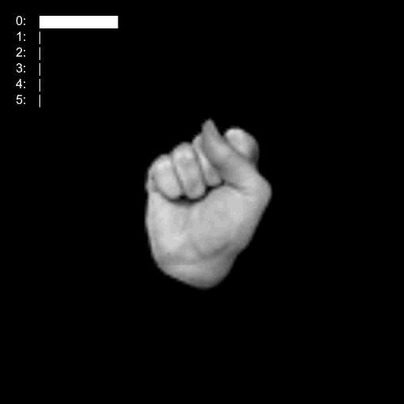

# Ann

Machine Learning library for .NET Core.

### Demo



## Installation
```
PM> Install-Package Ann.koryakinp
```
## Basic Usage
### Configure a Network by defining the structure and meta-parametres

```
var network = new Network(LossFunctionType.CrossEntropy, new Flat(0.001), 5);
```
Creates a neural network object with a Cross-Entropy loss function, flat learning rate 0.001 and 5 output classes

Add layers to network configuration:
```
network.AddInputLayer(128, 1); 
network.AddConvolutionLayer(16, 5);
network.AddActivationLayer(ActivatorType.Relu); 
network.AddPoolingLayer(2); 
network.AddFlattenLayer();
network.AddDenseLayer(256, true);
network.AddSoftMaxLayer();
```
`AddInputLayer(128, 1)` input layer, which expect input with dimensions 128x128x1
`AddConvolutionLayer(16, 5)` convolution layer with 16 filters of size 5x5xD where D is a depth of the output of a previose layer 
`AddActivationLayer(ActivatorType.Relu)` activation layer with ReLU activation function
`AddPoolingLayer(2)` pooling layer with a vertical and horizontal stride equals 2
`AddFlattenLayer()` flattens the result
`AddDenseLayer(256, true)` fully connected layer with biases
`AddSoftMaxLayer()` SoftMax activation

### Train Model
```
model.TrainModel(input, target);
```
First argument of the `TrainModel()` method accepts System.Array. The dimensions of the array must match with a input layer configuration.
Second argument accepts bool[]. The length of the array must match number of classes provided to `Network` constructor.

Weights and biases will be adjasted using Stochastic Gradient Descent with backpropagation.
### Save Model
After you are done with trainig you can save the model in JSON file for a later use:
```
var model = network.BuildModel();
model.Save("model.json");
```
### Use Model
```
var model = new Model("model.json");
double[] prediction = model.Predict(input);
```
`TrainModel()` method accepts System.Array, the dimensions of the array must match with a input layer configuration.

### Examples
There are two sample projects:

1. Ann.Mnist
2. Ann.Fingers


## Authors
Pavel koryakin <koryakinp@koryakinp.com>
## License
This project is licensed under the MIT License - see the [LICENSE.md](https://github.com/koryakinp/ann/blob/master/LICENSE) for details.
## Acknowledgments
- [Leon Bottou, Stochastic Gradient Descent Tricks](https://www.microsoft.com/en-us/research/publication/stochastic-gradient-tricks/)
- [Matt Mazur, A Step by Step Backpropagation Example](https://mattmazur.com/2015/03/17/a-step-by-step-backpropagation-example/)
- [Grant Sanderson, But what *is* a Neural Network?](https://youtu.be/aircAruvnKk)
